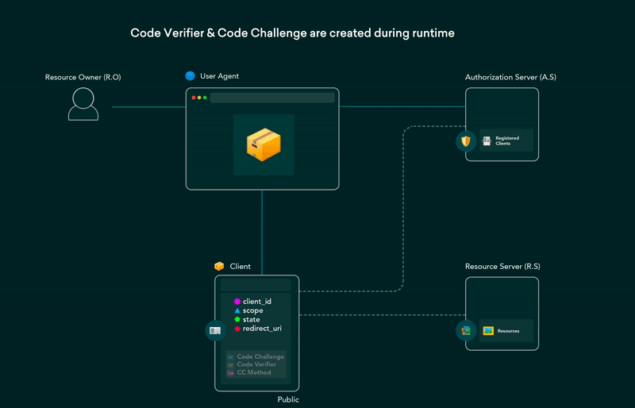

# DotNetExtensions.OAuth20.Server.Host - Hosted OAuth 2.0 Authorization Server

<!-- [](https://github.com/DotNetExtensions/OAuth20.Server.Host/actions/workflows/build.yml) -->
[](./LICENSE)
[](https://github.com/DotNetExtensions/OAuth20.Server.Host/graphs/contributors)

DotNetExtensions.OAuth20.Server.Host is a modular, cross-platform solution designed to implement OAuth 2.0 authorization flows in .NET applications. This project offers a fully hosted ASP.NET Core web application, making it easy to deploy and integrate secure authorization services across various environments.



*Figure 1: OAuth 2.0 [Protocol Flow](https://datatracker.ietf.org/doc/html/rfc6749#section-1.2) (taken from [dev.to article (authored by "Hem")](https://dev.to/hem/oauth-2-0-flows-explained-in-gifs-2o7a))*

## Table of Contents

- [Project Overview](#project-overview)
- [Key Features](#key-features)
- [Getting Started](#getting-started)
- [Installation](#installation)
  - [Docker Installation](#docker-installation)
  - [Kubernetes Installation](#kubernetes-installation)
  - [Helm Installation](#helm-installation)
  - [Windows Service or IIS Installation](#windows-service-or-iis-installation)
- [Running Tests](#running-tests)
- [Demo Projects](#demo-projects)
- [Project Structure](#project-structure)
- [Development Workflow](#development-workflow)
- [Roadmap](#roadmap)
- [Task List](#task-list)
- [Community and Support](#community-and-support)
- [Contributing](#contributing)
- [Security](#security)
- [Change Log](#change-log)
- [License](#license)
- [References](#references)

## Project Overview

Welcome to the DotNetExtensions.OAuth20.Server.Host project, a comprehensive solution for deploying a fully functional OAuth 2.0 Authorization Server. This repository contains an ASP.NET Core hosted web application that utilizes the core libraries from the [DotNetExtensions.OAuth20.Server](https://github.com/DotNetExtensions/OAuth20.Server) repository to deliver OAuth 2.0 endpoints, UI components, and data storage options.

## Key Features

- **Ready-to-Deploy Application:** Complete OAuth 2.0 Authorization Server with built-in UI and data storage.
- **Cross-Platform Deployment:** Supports deployment via Docker, Kubernetes, Helm, and as a Windows Service or IIS application.
- **Integration:** Leverages core and UI libraries from **DotNetExtensions.OAuth20.Server**.
- **User Interfaces:** Includes Blazor-based user-friendly Admin Panel and Personal Account UI for managing OAuth 2.0 consents and configurations.
- **Security Compliance:** Adheres to OAuth 2.0 [RFC 6749](https://datatracker.ietf.org/doc/html/rfc6749) with additional security measures.
- **CI/CD Integration:** Automated workflows using GitHub Actions for building, testing, and release uploading.
- **Comprehensive Testing:** Includes integration tests, load tests, demo projects, and configuration samples.

## Getting Started

To get started with DotNetExtensions.OAuth20.Server.Host, follow the installation instructions below to deploy the hosted application.

## Installation

**Prerequisites:**

- Docker (if using containerized deployments)
- Kubernetes (for cluster-based deployments)
- IIS (for IIS installations)

### Docker Installation

To run the OAuth 2.0 Server using Docker, execute:

```bash
docker pull dotnetextensions/oauth20serverhost:latest
docker run -d -p 5000:80 dotnetextensions/oauth20serverhost:latest
```

### Kubernetes Installation

To deploy the server on a Kubernetes cluster, use the following command:

```bash
kubectl apply -f https://github.com/DotNetExtensions/OAuth20.Server.Host/kubernetes-manifest.yaml
```

### Helm Installation

To install using Helm, use the following command:

```bash
helm repo add dotnetextensions https://dotnetextensions.com/oauth20/helm
helm install your-release-name dotnetextensions/oauth20serverhost --version x.x.x
```

Replace `x.x.x` with the desired version number.

### Windows Service or IIS Installation

You can install your OAuth 2.0 Server as a Windows Service or IIS website by following the instructions in the [Hosted Application Repository](https://github.com/DotNetExtensions/OAuth20.Server.Host).

## Running Tests

To run the integration and load tests included in the repository, use the following command:

```bash
dotnet test
```

## Demo Projects

This project includes demo scenarios and configuration samples within the repository to help you understand the server’s capabilities. Explore these demos to get started.

## Project Structure

This project is part of the following repositories:

- **Project Repository:** [DotNetExtensions/OAuth20](https://github.com/DotNetExtensions/OAuth20)
  - Essential Project Documentation

- **Library Repository:** [DotNetExtensions/OAuth20.Server](https://github.com/DotNetExtensions/OAuth20.Server)
  - Core Libraries
  - Data Source Libraries
  - UI Libraries
  - Infrastructure (tests, benchmarks, demos)
  - Available via NuGet and direct download.

- **Hosted Application Repository:** [DotNetExtensions/OAuth20.Server.Host](https://github.com/DotNetExtensions/OAuth20.Server.Host) (Current Repository)
  - ASP.NET Core Application
  - Integration with core and UI libraries
  - Infrastructure (tests, demos)
  - Deployment support via Docker, Kubernetes, Helm, Windows Service, IIS.

## Development Workflow

We follow the GitFlow branching strategy for managing our development and release processes. For detailed information, please refer to our [GitFlow Guide](https://github.com/DotNetExtensions/OAuth20/blob/main/GITFLOW.md).

## Roadmap

To understand our future plans and milestones, please refer to our [Roadmap](https://github.com/DotNetExtensions/OAuth20/blob/main/ROADMAP.md).

## Task List

For a detailed breakdown of ongoing and upcoming tasks, please refer to our [Task List](https://github.com/DotNetExtensions/OAuth20/blob/main/TASKLIST.md).

## Community and Support

For discussions, support, and feedback, please visit:

- [GitHub Project Page](https://github.com/orgs/DotNetExtensions/projects/17)
- [Project Website](https://dotnetextensions.com/oauth20)
- [Community Board](https://dotnetextensions.com/oauth20/community)
- [Support Page](https://dotnetextensions.com/oauth20/support)

## Contributing

We welcome contributions! Please read our [Contributing Guidelines](./CONTRIBUTING.md) to get started.

For detailed information on coding, formatting, and contribution conventions, please refer to our [Conventions](https://github.com/DotNetExtensions/OAuth20/blob/main/CONVENTIONS.md) file.

Please note that all contributions are expected to adhere to our [Code of Conduct](./CODE_OF_CONDUCT.md).

## Security

We take the security of our project seriously. If you discover any security vulnerabilities, please report them by following the instructions in our [Security Policy](./SECURITY.md).

## Change Log

All notable changes to this project are documented in our [CHANGELOG.md](./CHANGELOG.md).

## License

This project is licensed under the [MIT License](./LICENSE).

## References

This project is based on the OAuth 2.0 Authorization Framework, specifically following the guidelines set forth in [RFC 6749](https://datatracker.ietf.org/doc/html/rfc6749).
